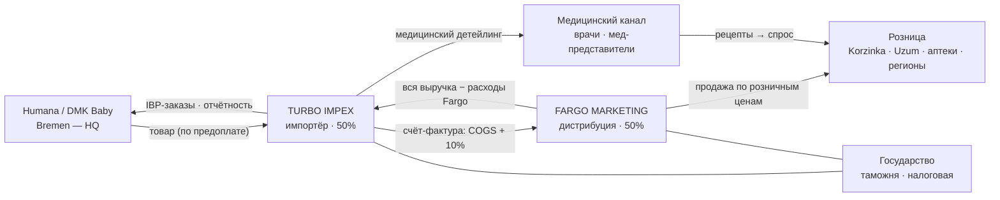
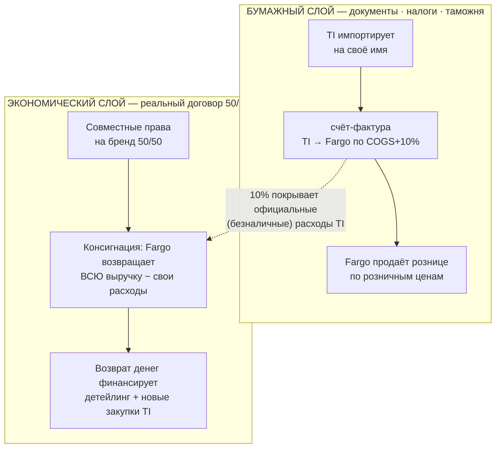
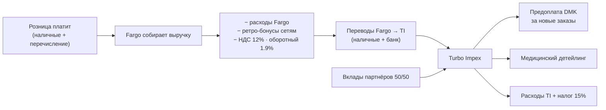

# Humana Uzbekistan — Business Operations Scheme

**Version 0.1 · 2026-08-26 · maintained by the owner (Turbo Impex) — draft, under review**

---

## 0 · To the AI reading this

This file is the canonical description of how the Humana Uzbekistan operation works. It is the source of truth for business logic. When building software, designing architecture, analyzing finances, or answering questions about this business:

1. **Everything here overrides your assumptions.** If something seems commercially unusual (two companies, one brand; two price layers), it is intentional — model it as written.
2. **The economic layer governs decisions; the paper layer governs documents** (§2). Never mix the two bases in one calculation.
3. Sections marked `⟨уточнить⟩` are known gaps — ask the owner rather than inventing.
4. Diagrams are Mermaid: parse them as data, they are not decorative.

---

## 1 · Entities

| Entity | Role |
|---|---|
| **Humana / DMK Baby** (Bremen, Germany) | Brand owner and manufacturer. Sells to Turbo Impex on **prepayment only**. Orders are placed through their **IBP system** by the 20th of each month. |
| **Turbo Impex (TI)** | Importer, 50% partner. Does: **medical detailing**, official import from HQ, all communication with HQ, and **financial reporting of the entire operation** (both companies — Fargo is obliged to supply its side's information). The owner of this document is part of TI. |
| **Fargo Marketing** | Distributor, 50% partner. Does: physical distribution to the market, deals with retail points, **managing receivables**, and all trade-side operations. Collects the sales money. |
| **The partnership** | TI + Fargo are separate legal entities that jointly own the **exclusive marketing rights** to the Humana brand in Uzbekistan, 50/50. |
| **Medical channel** | Doctors reached by TI's medical representatives. Prescriptions (verified via foil tracking) are the **primary demand driver** for the Platin line. |
| **Retail** | Chains (Korzinka ≈ 35% of revenue, Uzum Market, …), pharmacies, regional wholesale points. Served by Fargo. |
| **State** | Customs (import), tax authorities: TI pays 15% profit tax; Fargo pays 12% VAT + 1.9% turnover tax. |

---

## 2 · The deal has two layers — the most important thing to understand

**Paper layer (official documents, taxes, customs).** TI imports in its own name. TI writes a **счёт-фактура** and officially sells the goods to Fargo at **COGS + 10% margin**. This 10% margin exists to cover TI's *official* (non-cash) company expenses. Fargo accepts the invoice and sells at retail prices. The official акт сверки between the companies lives on this layer.

**Economic layer (the real partnership contract).** Economically this is **consignment within a 50/50 joint venture**: Fargo must return **all money collected from sales** to TI, minus Fargo's own expenses (and the taxes Fargo owes on its side). That returned money is what funds TI's medical detailing, the next prepayments to DMK, and TI's operations. Profit belongs to the venture 50/50 (capital was contributed 50/50).

**Consequences for any system built on this business:**
- Financial *decisions*, settlement between partners, and "who owes whom" are computed on the **economic layer**.
- Tax filings, customs, and official documents are produced on the **paper layer**.
- A number from one layer must never be compared with a number from the other (a paper акт сверки can never confirm the economic settlement — different contracts).

---

## 3 · Product flow, A → Z

1. **Order** — entered into Humana's IBP system **by the 20th** of month M. This is the de-facto committed order for goods **shipping in month M+4** (≈4 months production).
2. **Dispatch** — DMK loads a truck; the invoice date = dispatch date. TI has **prepaid** by this point (TI never owes DMK).
3. **Transit** — ~1 month on the road, plus ~1 week customs. Goods become sellable ≈ 5 months after the order deadline.
4. **TI warehouse** — goods arrive; each truck ≥98% full (~33 pallets / ~21.5 t) for transport-safety rules.
5. **Paper sale** — TI issues the счёт-фактура to Fargo (COGS + 10%).
6. **Distribution** — Fargo delivers to retail points under its own deals.
7. **Consumer** — demand for the Platin line is created upstream by medical detailing (a prescribed baby consumes ≈3 packs/month, moving Platin 1 → 2 → 3 as it ages); the Expert line is stable specialty demand.

Inventory policy: **≥4 months of stock cover at all times.**

---

## 4 · Money flow

- The receivable «Осталось за Fargo» = everything collected − Fargo's expenses − retro − Fargo's taxes − what has already been transferred − client receivables not yet collected. Working rule: the balance held by Fargo **should not exceed ≈1 month of collections**.
- Korzinka is on fast payment in exchange for an extra discount, booked as a Fargo expense («Korzinka финансирование»). ⟨уточнить: exact rate and start date⟩

---

## 5 · Information flow

| Information | Source of truth | Direction |
|---|---|---|
| Sales (quantities, by SKU × client) | Fargo's 1C («pinetrade») | Fargo → TI reporting; pulled into TI's finance app |
| Prices | Official справочник price list (invoiced amounts field pending from 1C developer) | TI |
| Stock levels | Monthly warehouse counts (daily 1C feed planned) | Fargo warehouse → TI |
| Prescriptions (demand driver) | Foil tracking, entered monthly | Medical team → TI |
| Orders/commitments to DMK | Humana IBP system exports | DMK ↔ TI |
| Fargo expenses, transfers, receivables | Fargo's records, reported to TI | Fargo → TI |
| Consolidated P&L, balance, settlement | **TI's finance app (humana-finance)** — TI reports for the entire operation | TI → partners |

⟨уточнить: what Fargo reports on what schedule, and in what form⟩

---

## 6 · Operating calendar

| Rhythm | Action |
|---|---|
| Monthly, by the 20th | IBP order for ship month +4 |
| Monthly | Warehouse stock count ⟨уточнить: exact day — currently ~20th, target month-end⟩ |
| Monthly | Month close in the finance app; P&L shows closed months only |
| Monthly | Prescription count entry (foil tracking) |
| Ongoing | Fargo → TI transfers ⟨уточнить: agreed cadence⟩ |
| Quarterly | TI profit-tax filing |
| ⟨уточнить⟩ | Retro-bonus settlement cadence with chains |

---

## 7 · Rules & invariants (an AI must never violate these)

1. **TI never owes DMK** — always prepayment. «Товар в пути» on the balance = TI's advances.
2. **Economic layer for decisions, paper layer for documents** (§2).
3. **Fargo's 1C is the source of truth for sales quantities.** Revenue = qty × справочник price − retro%, until invoiced amounts arrive from 1C.
4. Fargo cannot report brand-level cash (it distributes other brands too) — the economic settlement is verifiable **only through TI's model**, not through Fargo's cashbox.
5. Taxes: Fargo 12% VAT + 1.9% turnover; TI 15% profit tax. Fargo's taxes are already withheld inside the settlement receivable — never double-count them as liabilities.
6. Stock cover ≥ 4 months; trucks ≥ 98% full; order lead = 4 months production + 1 month transit + 1 week customs.
7. Demand for Platin is **cohort-driven by medical detailing** (prescriptions × retention curve × ≈3 packs/month; stages P1 0–6мес → P2 6–12 → P3 12+). Expert line is stable run-rate. Births in Uzbekistan decline 3–5%/yr — growth must come from share.
8. The 10% paper margin covers TI's official (non-cash) expenses — it is not profit.

---

## 8 · Systems landscape

| System | Owns | Notes |
|---|---|---|
| **humana-finance app** (Vercel + Neon) | Consolidated P&L, balance, TI↔Fargo settlement, supply planning (IBP mirror), month close, invoice OCR | TI's reporting instrument for the whole operation |
| Fargo 1C «pinetrade» | Sales transactions, stock | Pull API for sales; stock feed planned |
| Humana IBP | Orders, forecasts, open orders at DMK | Monthly export → synced into the app |
| Excel (legacy) | Historical workbook | Superseded by the app |
| Telegram data requests | Collecting figures from staff/Fargo | Built into the app |

---

## 9 · Glossary

- **Счёт-фактура** — the official invoice TI issues to Fargo (paper layer).
- **Акт сверки** — official reconciliation act between the companies; lives on the paper layer only.
- **Ретро (ретро-бонус)** — percentage rebate paid to retail chains.
- **IBP** — Humana HQ's Integrated Business Planning system where TI enters forecasts and orders.
- **Детейлинг** — medical representatives promoting to doctors; source of prescriptions.
- **Foil tracking** — verification mechanism counting real prescriptions (recruited babies).
- **Открытый слот** — the next order deadline and its ship month (deadline 20th → ships +4 months).
- **Open Orders** — ordered from DMK but not yet picked up (cumulative Partner Order − Partner Purchase).
- **Консигнация** — the economic reality: goods effectively remain the venture's until sold; Fargo remits collections, not a purchase price.

---

## 10 · Open items for the owner

- ⟨уточнить⟩ Korzinka deal: exact extra-discount rate and start date.
- ⟨уточнить⟩ Fargo reporting package: what, when, in what form.
- ⟨уточнить⟩ Transfer cadence agreement (how often Fargo must remit).
- ⟨уточнить⟩ Retro settlement rhythm with chains.
- ⟨уточнить⟩ Stock-count day policy (move to month-end?).
- ⟨уточнить⟩ Detailing operations: team size, coverage, cost structure — worth its own section?
- ⟨уточнить⟩ Anything about Uzum/online channel specifics?

*Changelog: v0.1 (2026-08-26) — initial skeleton from the owner's briefing + established facts from the finance-app project.*
